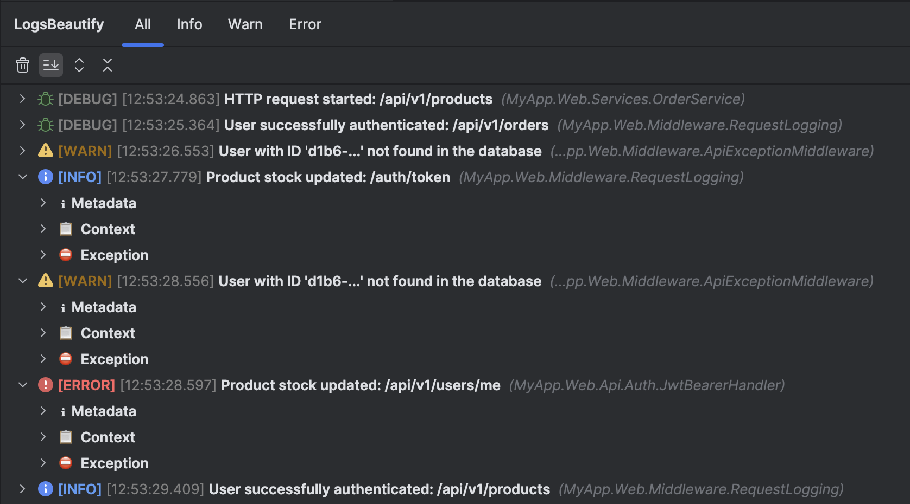
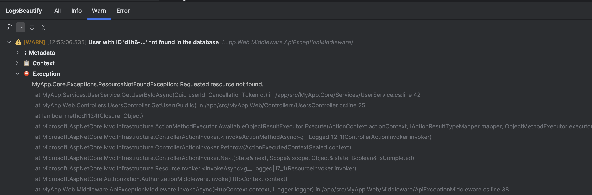
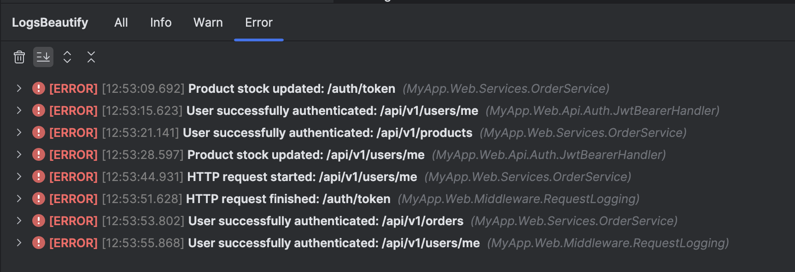
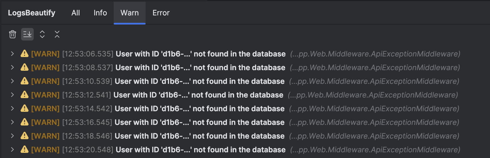
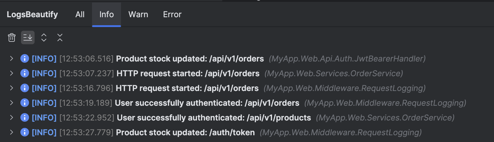

# LogsBeautify - 1.0

LogsBeautify — это плагин для IDE JetBrains (IntelliJ IDEA, Rider и др.), который превращает нечитаемые структурные JSON-логи в интерактивное, отформатированное и удобное для анализа дерево.







## 🚀 Основные возможности

* **Автоматический перехват логов**: Не требует настройки — просто запустите приложение, и логи появятся в отдельной вкладке.
* **Структурированное дерево**: Иерархическое отображение JSON-логов вместо плоского текста.
* **Цветовое кодирование**: Уровни логов (INFO, WARN, ERROR) подсвечиваются разными цветами.
* **Группировка по вкладкам**: Вкладки "All", "Info", "Warn", "Error" для быстрой фильтрации.
* **Разбор Exception**: Стектрейсы форматируются в виде раскрывающихся списков.
* **Утилиты в панели**: Кнопки для очистки логов, управления автопрокруткой и разворачивания/сворачивания дерева.

## 🛠️ Установка

### Способ 1: Установка из ZIP (быстро)

1. Скачайте `.zip`-архив плагина со страницы проекта.
2. В IDE зайдите в **Settings/Preferences → Plugins**.
3. Нажмите ⚙️ → **Install Plugin from Disk...**.
4. Выберите скачанный `.zip` и нажмите **OK**.
5. Перезапустите IDE.

### Способ 2: Установка из кастомного репозитория (рекомендуется)

1. Скопируйте URL:

   ```
   https://github.com/TYAlvoro/LogsBeautify/releases/latest/download/updatePlugins.xml
   ```
2. В IDE зайдите в **Settings/Preferences → Plugins**.
3. Нажмите ⚙️ → **Manage Plugin Repositories...**.
4. Нажмите **+**, вставьте URL и **OK**.
5. В поиске Marketplace найдите **LogsBeautify**, установите и перезапустите IDE.

## ⚙️ Как использовать

1. **Открыть окно плагина**:

   * Главное меню: **View → Tool Windows → LogsBeautify**
   * Или дважды Shift и введите `LogsBeautify`
2. **Запустить приложение**: любая Run/Debug-конфигурация (.NET, Java, Node.js и т.д.).
3. **Анализировать логи**: вывод JSON-логов автоматически появится во вкладках.
4. **Фильтровать**: используйте вкладки **All**, **Info**, **Warn**, **Error**.
5. **Панель инструментов**:

   * 🗑️ **Clear All** — очистить текущую вкладку.
   * ⬇️ **Toggle Autoscroll** — включить/отключить автопрокрутку.
   * ➕ **Expand All** — развернуть все узлы.
   * ➖ **Collapse All** — свернуть все узлы.

## ВАЖНО:
Плагин был написан под конкретный формат логов моей команды, но несмотря на то, что он вписывается в общепринятые форматы, в вашем проекте могут быть отличия, корректное отображение которых не гарантируется.
